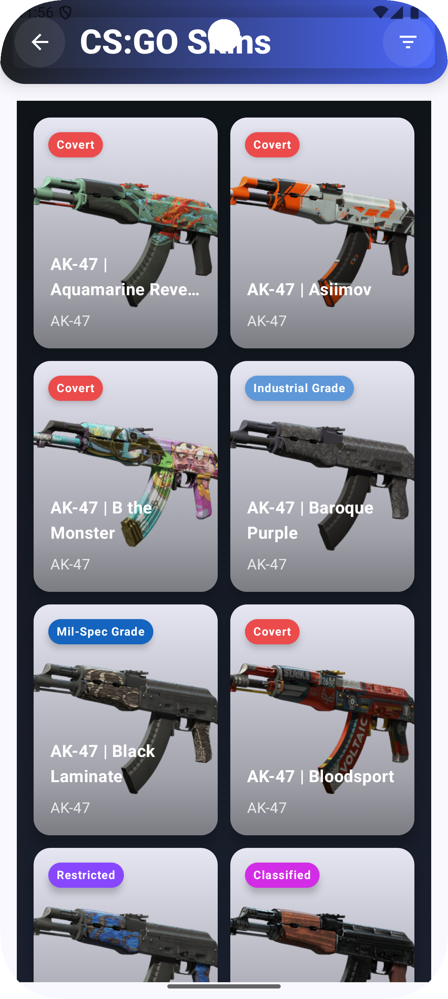

# CS:GO Arsenal

CS:GO Arsenal is an Android application that allows you to explore skin, agent, sticker, and crate collections for Counter-Strike: Global Offensive and CS2 through a modern and user-friendly interface.

---

## 🚀 Features

- Skin, Agent, Sticker, and Crate Catalog
- Modern and fast interface (Jetpack Compose)
- Filtering & Sorting (rarity, collection, price range, etc.)
- Add/Remove from favorites
- Quick search (for agents)
- Multi-language support (Turkish/English)
- Dark/Light theme support
- Responsive and animated design

---

## 🗂️ Data Source

This application uses [ByMykel/CSGO-API](https://github.com/ByMykel/CSGO-API).

---

## 📱 Screenshots

### Main Screens
| Splash | Home | Navigation | Agents |
|--------|------|------------|--------|
|  |  |  |  |

### Skins & Filters
| Skins Grid | Filter Sheet | Filter Active | Skin Detail |
|------------|--------------|---------------|-------------|
|  |  |  |  |

### Crates & Stickers
| Crates Grid | Crate Detail | Stickers Grid | Sticker Detail |
|-------------|--------------|---------------|----------------|
|  |  |  |  |

### Search & Favorites
| Agent Search | Agent Detail | Favorites |
|--------------|--------------|-----------|
|  |  |  |

---

## 📦 Technologies Used

- Kotlin, Jetpack Compose
- MVVM, Clean Architecture
- Hilt (Dependency Injection)
- Retrofit, Coil
- Material3
